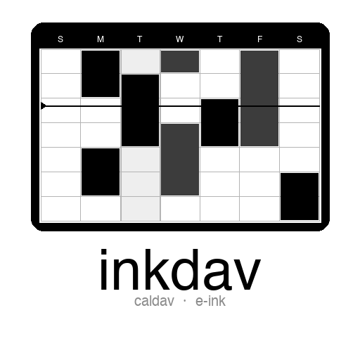
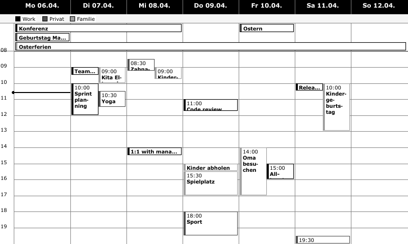

# Inkdav



A self-hosted week calendar for [TRMNL](https://usetrmnl.com) e-ink displays. Fetches events from CalDAV (Nextcloud, iCloud, Fastmail, …), renders them as a 1-bit PNG week grid, and pushes the image to your TRMNL device every 15 minutes.



---

## How it works

```
CalDAV calendars          Inkdav
  (Nextcloud, etc.)  ───►  fetches & renders
                           every 15 minutes
                                │
                         webhook POST (PNG)
                                │
                           BYOS server        ◄── TRMNL device polls
                           (larapaper)
```

Two Docker containers run side by side:
- **BYOS** (`larapaper`) — the TRMNL server your device connects to
- **Inkdav** — fetches CalDAV, renders the PNG, and pushes it to BYOS

---

## Prerequisites

- Docker + Docker Compose
- A TRMNL device registered to your BYOS instance
- CalDAV credentials for each calendar (Nextcloud app password, iCloud app-specific password, etc.)

---

## Setup

### 1. Clone & configure

```bash
git clone https://github.com/stfngrt/inkdav.git
cd inkdav
cp .env.example .env
```

Open `.env` and fill in two values:

| Variable | What to put |
|----------|-------------|
| `BYOS_APP_KEY` | Any random secret — generate one with `openssl rand -base64 32` |
| `LOCAL_IP` | The LAN IP of the machine running Docker (e.g. `192.168.1.42`) |

### 2. Start the stack

```bash
docker compose up -d
```

| What | URL |
|------|-----|
| BYOS dashboard | http://localhost:4567 |
| Inkdav admin UI | http://localhost:5001 |
| Rendered PNG (current week) | http://localhost:8080/week.png |
| Health check | http://localhost:8080/health |

### 3. Add your calendars

Open **http://localhost:5001** and add each calendar:

| Field | Example |
|-------|---------|
| CalDAV URL | `https://cloud.example.com/remote.php/dav/calendars/alice/personal/` |
| Username | your Nextcloud username |
| App password | create one under Nextcloud → Settings → Security → App passwords |
| Name | display label shown in the grid legend |
| Color | hex color (converted to a fill pattern on e-ink — see below) |

**Not sure of your calendar URL?** List all calendars on your Nextcloud:
```bash
curl -u "alice:APP-PASSWORD" \
  -X PROPFIND "https://cloud.example.com/remote.php/dav/calendars/alice/" \
  -H "Depth: 1" | grep -o 'href>[^<]*' | grep dav
```

**Color guide** — hex colors are converted to greyscale for the 1-bit display:

| Hex | Rendered as |
|-----|-------------|
| `#000000` | Solid black |
| `#555555` | Dark grey |
| `#999999` | Mid grey |
| `#cccccc` | Light grey |

### 4. Create an Image Webhook plugin in BYOS

1. Open the BYOS dashboard at **http://localhost:4567**
2. Go to **Plugins → New Plugin**, choose type **Image Webhook**, give it a name (e.g. `Week Calendar`), and save
3. Copy the webhook URL from the plugin page — it looks like:
   `http://localhost:4567/api/plugin_settings/<uuid>/image`
4. Go to **Devices → your device → Playlist** and add the plugin

### 5. Connect Inkdav to BYOS

Open **http://localhost:5001**, go to **Webhooks**, and add:

| Field | Value |
|-------|-------|
| Name | e.g. `BYOS` |
| Webhook URL | `http://trmnl-byos:8080/api/plugin_settings/<uuid>/image` |

> **Important:** use `http://trmnl-byos:8080` (Docker container name + internal port), **not** `http://localhost:4567`.
> The two containers share a Docker bridge network, so `trmnl-byos` resolves correctly from inside Inkdav. `localhost:4567` is the host-side port and is unreachable from within Docker.

Click **Trigger refresh** to send the first image. Confirm it worked:

```bash
docker compose logs inkdav --tail=20
# You should see:  Webhook [BYOS] → HTTP 200
```

---

## Configuration

Everything is managed through the admin UI at **http://localhost:5001** and stored in a Docker volume (`inkdav_data`). No need to edit `.env` after initial setup.

The following environment variables only apply on **first run** (before `config.json` exists):

| Variable | Default | Description |
|----------|---------|-------------|
| `RENDER_WIDTH` | `800` | PNG width in pixels |
| `RENDER_HEIGHT` | `480` | PNG height in pixels |
| `REFRESH_SECONDS` | `900` | Seconds between CalDAV fetches |
| `TZ` | `Europe/Berlin` | Initial timezone |

---

## Troubleshooting

| Symptom | Fix |
|---------|-----|
| No events shown in PNG | Check `/health` and `docker compose logs inkdav` |
| `Webhook failed: Connection refused` | Webhook URL uses `localhost` — change to `http://trmnl-byos:8080/...` |
| `Webhook failed: 400 Bad Request` | Plugin type in BYOS is not **Image Webhook** — recreate the plugin |
| `Webhook failed: 404 Not Found` | Wrong UUID in the webhook URL — copy it from the BYOS plugin page |
| HTTP 200 but no image on device | Plugin not added to the device's playlist in BYOS |
| 401 from CalDAV | Wrong app password — create a new one in Nextcloud → Settings → Security |
| 404 from CalDAV | Wrong calendar URL — use the `curl PROPFIND` command above to list slugs |
| Wrong timezone | Change in admin UI → Settings → Timezone |
| Config lost after restart | Never run `docker compose down -v` — it deletes the `inkdav_data` volume. `docker compose down` is safe. |

---

## Project layout

```
inkdav/
├── docker-compose.yml
├── .env.example
└── app/
    ├── Dockerfile
    ├── config.py          # persistent config (JSON + env bootstrap)
    ├── caldav_client.py   # CalDAV fetcher
    ├── renderer.py        # Pillow-based PNG renderer
    ├── server.py          # PNG server + Flask admin + webhook dispatch
    └── templates/
        └── admin.html
```
